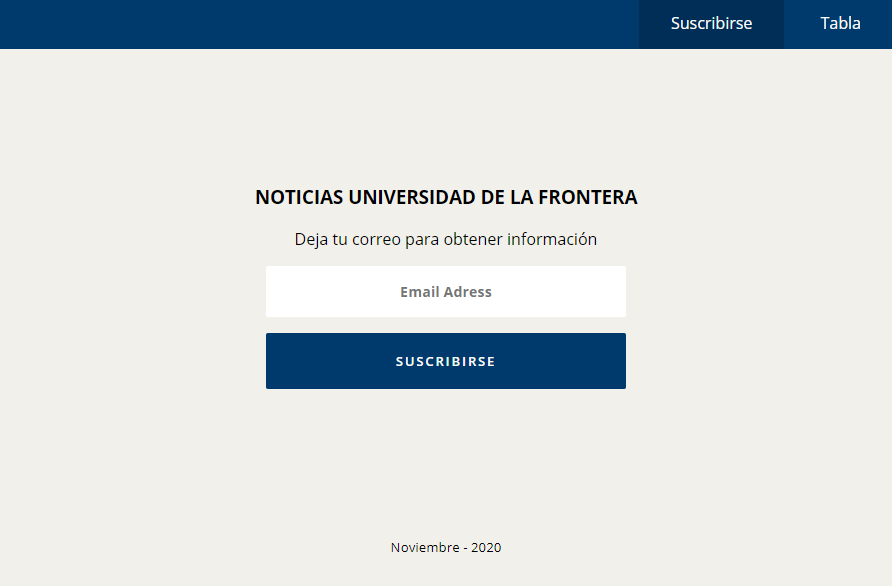

## Desafío 1
Este desafío tiene por objetivo poner en práctica los conocimientos adquiridos de HTML y CSS.

El desafío consiste en dos vistas, en donde la primera debe ser un formulario y la segunda una tabla, en cada una de estas vistas se debe generar los elementos HTML faltantes y sus estilos.

Ambas vistas comparten un **header** y un **footer** sin estilos. La primera tarea del desafío es generar los estilos de estos elementos en el archivo **main.css**, utilizando los selectores de sus ID.

El resultado de los estilos generados para el header y el footer debe ser el siguiente:

 
Al igual que el header y el footer, la vista del formulario también debe ser igual a la imagen anterior. En el archivo **01-form.html** se debe crear el formulario y los elementos HTML necesarios para generar una vista igual a la imagen anterior. Los estilos del formulario se deben trabajar en el archivo **01-form.css**.

Para el caso de la vista de la tabla (**02-table.html**), se debe crear una tabla con un mínimo de 4 columnas (nombre, correo, teléfono, etc.). La idea es crear una tabla que sea llamativa utilizando diversos estilos en sus elementos. Por ejemplo, utilizar un **background-color** diferente en el thead y en el tbody. Los estilos de esta vista se deben trabajar en el archivo **02-table.css**.

**Nota:** En el archivo **main.css** se encuentran las variables con colores a utilizar.
